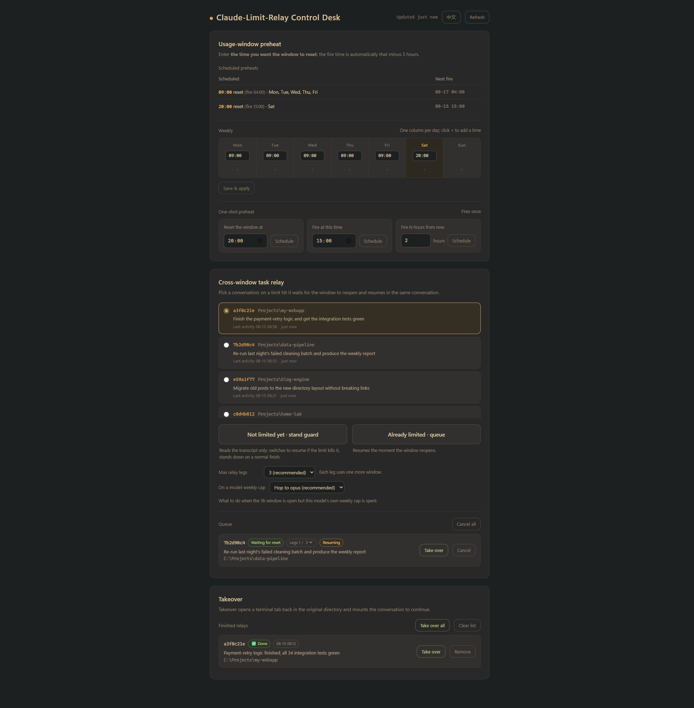

# claude-limit-relay

**English** | [简体中文](README.zh-CN.md) | [日本語](README.ja.md) | [한국어](README.ko.md)

For Claude subscribers who work in the Claude Code CLI. It does two things:

- **Usage-window preheat** — Windows Task Scheduler pre-warms the usage window at the time you choose (the 5-hour window is anchored by the first message sent while no window is active), so when you actually start working, your session spans two 5-hour windows
- **Cross-window task relay** — when a task is about to hit or has hit the 5-hour limit, tasks queued on the panel stand guard automatically, resume the moment the quota returns, and you take the window back with one click when you're back

## Web panel

Local address: `localhost:7878` (bilingual English/中文, one-click toggle in the header)

Three modules: usage-window preheat / task relay queue / takeover



## Quick start

**Requirements**: Windows 10/11; [Claude Code CLI](https://code.claude.com/docs) installed and logged in; a Claude subscription; PowerShell 7 (pwsh); no admin rights needed

**Recommended: paste this into Claude Code (or any AI coding tool) and let it install everything for you:**

```text
Clone https://github.com/MagicYangG/claude-limit-relay and set it up:
1. git clone, then run install.ps1 inside the repo directory
2. Ask me for the weekly times I want the window to reset, write them into schedule.json
   (reset = the target reset time; the fire time is automatically reset minus 5 hours)
3. Run ./test.ps1 and confirm every case passes
4. Run preheat apply, then show me the output of preheat status
Do not register or change anything beyond what install.ps1 and preheat apply create.
```

When it's done, open `http://localhost:7878` in your browser and drive everything from the panel.

**Manual install is three steps**: `git clone` → `./install.ps1` → run `preheat apply` in a new terminal. Full commands in the [command reference](#command-reference).

## Notes

1. **Claude Code CLI required**: both preheat and relay execute through the Claude Code CLI
2. **The resumed window**: a resume runs in the same directory, same conversation, same model and effort — but in a different terminal window. After taking over, close the original window so two windows never race-write one transcript. Resumes run with `--dangerously-skip-permissions` (nobody is present to approve tool calls); see [SECURITY.md](SECURITY.md) for what that implies.
3. **Model weekly-cap fallback**: Claude subscriptions carry model-specific weekly caps. When queuing a task you choose what happens if that cap is hit — hop to opus and finish, or stop and wait for you

## Command reference

The panel covers everyday use; the commands below are for terminal people and scripts.

### Preheat

```powershell
preheat apply         # register weekly preheat tasks from schedule.json (re-run after edits)
preheat status        # local activity + registered tasks + recent journal
preheat reset 20:00   # one-shot: make the window reset at 20:00 (fires at 15:00)
preheat at 15:00      # one-shot: fire at 15:00
preheat +2h           # one-shot: fire 2 hours from now
preheat off           # remove all preheat tasks
```

In `schedule.json`, `reset` is the **target reset time**; the fire time is automatically reset − 5h. An empty `proxy` means no proxy.

### Relay

**The two commands**: `relay arm -Watch` before you leave, `relay takeover` when you're back.

relay is pure PowerShell and depends on no Claude process. A resume executes `claude --resume <original-session> -p "<continuation prompt>"` — the full conversation history is mounted and a real prompt tells the model what to continue.

| Scenario | Command |
|---|---|
| Already limited, you're at the keyboard | `relay arm` (interactive session picker; `-Yes` skips it) |
| Expecting to hit the limit later | `relay arm -Watch` (sentry: zero probing, life signs read from the transcript alone) |
| Back at the desk, pick up the scene | `relay takeover` (cd into a directory that hits the session's resume bucket + mount the original conversation + open the interactive CLI with approvals still skipped; close the original window so two windows don't write the same transcript) |

```powershell
relay arm -Prompt "finish the tests before wrapping up"   # custom continuation prompt
relay status                              # queue state / probe task / recent events
relay legs a3f8 5                         # change a session's leg budget in place, no re-arm
relay disarm                              # cancel (kills any in-flight resume)
```

How many windows one task can span: the one you worked in + 3 legs by default = up to 4 windows (about 20 hours). Tune with `-MaxLegs N` (or `relay legs` / the panel dropdown at any time) — mind the weekly cap.

### Uninstall

```powershell
preheat off      # remove all preheat tasks
relay disarm     # cancel all queued relays
```

Then delete the lines between `# >>> claude-limit-relay functions >>>` and
`# <<< claude-limit-relay functions <<<` in your PowerShell profile, and remove
the repo directory.
