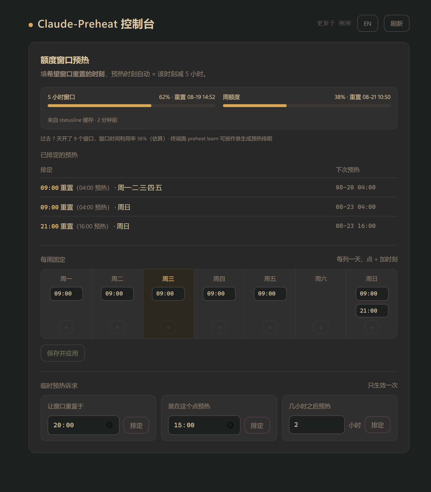

# claude-preheat

[English](README.md) | **简体中文** | [日本語](README.ja.md) | [한국어](README.ko.md)

本工具针对在 Windows 上使用 Claude Code CLI 的 Claude 订阅用户，只做一件事：5 小时额度窗口由额度空窗期的第一条消息锚定——定时发出一条极小的 ping，把窗口锚在你规定的时刻，让你真正开工时窗口已经在走，工作可以横跨两个窗口，而不是干到一半被掐断。

## 可视化控制面板

本机地址：`localhost:7878`（中/英双语，页头一键切换）

模块：实时额度条（5 小时 + 周限，含精确重置时刻——跑一次 `preheat statusline on` 即可喂入）/ 每周重置时刻编辑器（写入 `schedule.json` 并直接生效）/ 一次性预热 / 近 7 天窗口利用率小结（底层即 `preheat learn`）



## 快速开始

**环境要求**：Windows 10/11；已安装并登录 [Claude Code CLI](https://code.claude.com/docs)；Claude 订阅用户；PowerShell 7（pwsh）；无需管理员权限

**推荐安装方式：把下面这段直接粘给 Claude Code（或其它 AI 编程工具），让它替你装好：**

```text
克隆 https://github.com/MagicYangG/claude-preheat 并完成安装：
1. git clone 后，在仓库目录里运行 install.ps1
2. 问我每周希望窗口重置的时刻，写进 schedule.json
   （reset 填目标重置时刻，预热时刻自动 = reset 减 5 小时）
3. 运行 ./test.ps1，确认全部用例通过
4. 运行 preheat apply，把 preheat status 的输出结果给我看
除 install.ps1 和 preheat apply 创建的内容外，不要注册或改动任何东西。
```

装完在浏览器打开 `http://localhost:7878`，用可视化控制面板操作。

**手动安装有三步**：`git clone` → `./install.ps1` → 新开终端跑 `preheat apply`。全部命令见文末[命令参考](#命令参考)。

## 注意事项

1. **需要安装 Claude Code CLI**：预热就是通过 CLI 发出的一条极小 headless 提示词
2. **ping 到已激活的窗口无副作用**：只花一条微不足道的消息，其余什么都不动
3. **睡眠中唤醒**：定时任务要把电脑从睡眠中叫醒，须在当前电源计划里启用唤醒定时器——关着时 `preheat status` 会给出警告

## 接续（relay）去哪了？

v0.2.0 曾内置跨额度自动续跑（"relay"），在额度恢复后复活被撞限杀死的会话。Claude Code v2.1.234 加入了原生撞限自动续跑——默认开启，可在 `/config` 的 "Continue automatically at usage limit" 处关闭——它在进程内处理"人守在键盘前"的场景，自带精确重置时刻，比任何外部看守都做得好。v0.3.0 选择退役 relay，不与平台竞争；最后一个含 relay 的版本保留在 [v0.2.0](https://github.com/MagicYangG/claude-preheat/releases/tag/v0.2.0) 标签。原生功能不做的事——在你坐下之前把窗口提前启动——正是 preheat 做的事。

## 命令参考

推荐使用可视化控制面板。若要使用终端命令操作，可参照下文。

```powershell
preheat apply           # 按 schedule.json 注册每周预热任务（改表后重跑即生效）
preheat status          # 本机活动 + 排定任务 + 最近记录
preheat reset 20:00     # 一次性：让窗口在 20:00 重置（自动 15:00 预热）
preheat at 15:00        # 一次性：15:00 预热
preheat +2h             # 一次性：2 小时后预热
preheat learn           # 按最近 30 天作息给出排期建议 + 窗口利用率报告（learn auto 一键写入并生效）
preheat statusline on   # 透传接入 statusline，让精确重置时刻喂入面板额度条（纯透传；off 还原）
preheat off             # 移除全部预热任务
claude-panel            # 打开本地可视化控制面板
```

`schedule.json` 里 `reset` 填**目标重置时刻**，预热时刻自动 = reset − 5h；`proxy` 留空表示不经代理。

## 卸载

```powershell
preheat off             # 移除全部预热任务
preheat statusline off  # 还原原始 statusline（若开启过透传）
```

然后删除 PowerShell 配置文件（`$PROFILE.CurrentUserAllHosts`）里 `# >>> claude-preheat functions >>>` 到
`# <<< claude-preheat functions <<<` 之间几行（旧版安装的标记可能是
`claude-limit-relay`），再删除本仓库目录。
